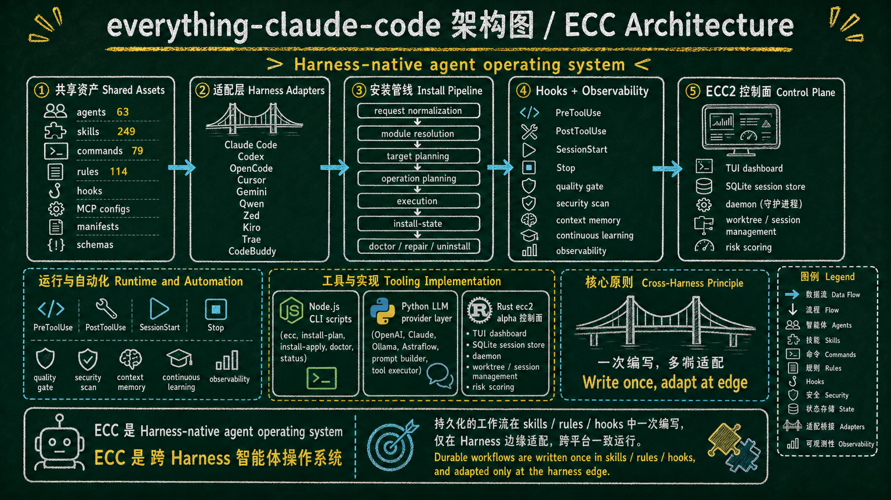
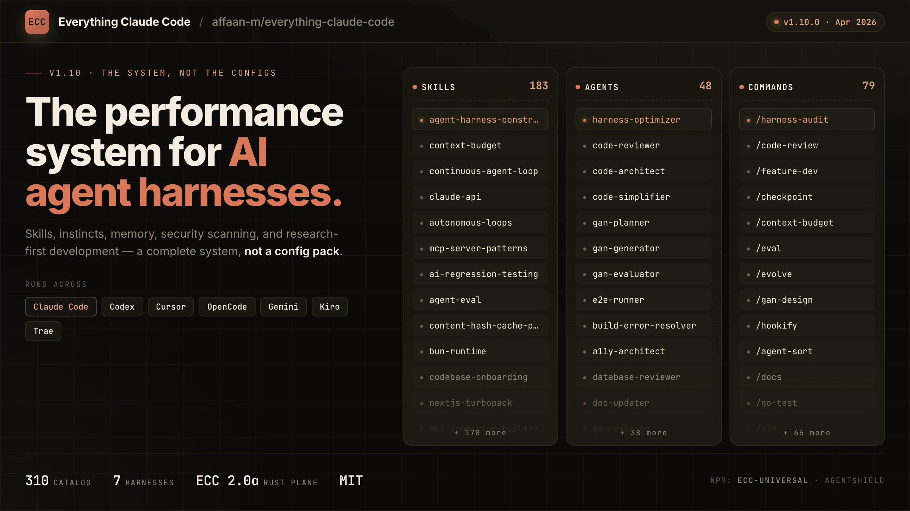

# ECC



[](https://github.com/affaan-m/ECC/stargazers)
[](https://github.com/affaan-m/ECC/network/members)
[](https://github.com/affaan-m/ECC/graphs/contributors)
[](https://www.npmjs.com/package/ecc-universal)
[](https://www.npmjs.com/package/ecc-agentshield)
[](https://github.com/marketplace/ecc-tools)
[](LICENSE)


> **182K+ stars** | **28K+ forks** | **170+ contributors** | **12+ language ecosystems** | **跨 harness 智能体工作流**

---

<div align="center">

**Language / 语言 / 語言 / Dil / Язык / Ngôn ngữ**

[**English**](README.md) | [Português (Brasil)](docs/pt-BR/README.md) | [简体中文](README.zh-CN.md) | [繁體中文](docs/zh-TW/README.md) | [日本語](docs/ja-JP/README.md) | [한국어](docs/ko-KR/README.md)
 | [Türkçe](docs/tr/README.md) | [Русский](docs/ru/README.md) | [Tiếng Việt](docs/vi-VN/README.md) | [ไทย](docs/th/README.md) | [Deutsch](docs/de-DE/README.md)

</div>

---

**适用于智能体工作的 harness 原生操作系统。基于真实的多 harness 工程工作流构建。**

不仅仅是配置。一个完整的系统：技能、直觉、内存优化、持续学习、安全扫描和研究优先开发。生产就绪的智能体、技能、钩子、规则、MCP 配置和传统命令 shims，经过 10 多个月的密集日常使用不断进化，用于构建真实产品。

适用于 **Codex**、**Claude Code**、**Cursor**、**OpenCode**、**Gemini**、**Zed**、**GitHub Copilot** 和其他 AI 智能体 harness。

ECC v2.0.0-rc.1 在该可复用层之上增加了公共 Hermes 操作员故事：从 [Hermes 设置指南](docs/HERMES-SETUP.md) 开始，然后查看 [rc.1 发布说明](docs/releases/2.0.0-rc.1/release-notes.md) 和 [跨 harness 架构](docs/architecture/cross-harness.md)。

---

<table>
<tr>
<td width="33%" align="center">
  <a href="https://ecc.tools/pricing">
    <strong> ECC Pro</strong><br />
    <sub>私有仓库 · GitHub 应用 · $19/席位/月</sub>
  </a>
</td>
<td width="33%" align="center">
  <a href="https://github.com/affaan-m/ECC/discussions">
    <strong>社区</strong>
    <br />
    <sub>讨论 · 问答 · 展示与分享</sub>
  </a>
</td>
<td width="33%" align="center">
  <a href="https://github.com/apps/ecc-tools">
    <strong> GitHub 应用</strong><br />
    <sub>安装 · PR 审计 · 免费版</sub>
  </a>
</td>
</tr>
</table>

<sub>**开源保持免费。** 本仓库永远采用 MIT 许可。</sub>

---

## 指南

本仓库仅包含原始代码。指南解释了所有内容。

<table>
<tr>
<td width="33%">
<a href="https://x.com/affaanmustafa/status/2012378465664745795">

</a>
</td>
<td width="33%">
<a href="https://x.com/affaanmustafa/status/2014040193557471352">

</a>
</td>
<td width="33%">
<a href="https://x.com/affaanmustafa/status/2033263813387223421">

</a>
</td>
</tr>
<tr>
<td align="center"><b>简明指南</b><br/>设置、基础、理念。<b>先阅读此指南。</b></td>
<td align="center"><b>详细指南</b><br/>Token 优化、内存持久化、评估、并行化。</td>
<td align="center"><b>安全指南</b><br/>攻击向量、沙箱、清理、CVE、AgentShield。</td>
</tr>
</table>

| 主题 | 你将学到 |
|-------|-------------------|
| Token 优化 | 模型选择、系统提示精简、后台进程 |
| 内存持久化 | 自动跨会话保存/加载上下文的钩子 |
| 持续学习 | 从会话中自动提取模式到可复用技能 |
| 验证循环 | 检查点评估与连续评估、评分器类型、pass@k 指标 |
| 并行化 | Git worktrees、级联方法、何时扩展实例 |
| 子智能体编排 | 上下文问题、迭代检索模式 |

---

## 新内容

### v2.0.0-rc.1 — 界面刷新、操作员工作流和 ECC 2.0 Alpha（2026 年 4 月）

- **仪表板 GUI** — 新的基于 Tkinter 的桌面应用程序（`ecc_dashboard.py` 或 `npm run dashboard`），支持深色/浅色主题切换、字体自定义，以及页眉和任务栏中的项目徽标。
- **公共界面与活跃仓库同步** — 元数据、目录计数、插件清单和面向安装的文档现在与实际开源界面一致：63 个智能体、249 个技能和 79 个传统命令 shims。
- **操作员和出站工作流扩展** — `brand-voice`、`social-graph-ranker`、`connections-optimizer`、`customer-billing-ops`、`ecc-tools-cost-audit`、`google-workspace-ops`、`project-flow-ops` 和 `workspace-surface-audit` 完善了操作员通道。
- **媒体和发布工具** — `manim-video`、`remotion-video-creation` 和升级的社交发布界面使技术解说和发布内容成为同一系统的一部分。
- **框架和产品界面增长** — `nestjs-patterns`、更丰富的 Codex/OpenCode 安装界面，以及扩展的跨 harness 打包使仓库不仅限于 Claude Code。
- **Itô 预测市场技能包** — `ito-market-intelligence`、`ito-basket-compare`、`ito-trade-planner`、`ito-data-atlas-agent`、`prediction-market-oracle-research` 和 `prediction-market-risk-review` 添加了公共的、非咨询性的市场/篮子工作流，同时保持实时 Itô API 访问受限并与 ECC Tools 计费分离。
- **优化技能包** — `parallel-execution-optimizer`、`benchmark-optimization-loop`、`data-throughput-accelerator`、`latency-critical-systems` 和 `recursive-decision-ledger` 将重复的速度/递归提示转换为有界的基准、吞吐量和决策账本工作流。
- **ECC 2.0 alpha 在树中** — `ecc2/` 中的 Rust 控制面原型现在可以在本地构建，并公开 `dashboard`、`start`、`sessions`、`status`、`stop`、`resume` 和 `daemon` 命令。它可作为 alpha 使用，尚未正式发布。
- **操作员状态快照** — `ecc status --markdown --write status.md` 将本地状态存储转换为可移植的交接文档，涵盖就绪状态、活跃会话、技能运行状况、安装状况、待处理治理事件，以及来自 Linear/GitHub/handoffs 的链接工作项。使用 `ecc work-items upsert ...` 进行手动条目输入，使用 `ecc work-items sync-github --repo owner/repo` 获取 PR/issue 队列状态，使用 `ecc status --exit-code` 在需要关注就绪状态时使自动化失败。
- **生态系统强化** — AgentShield、ECC Tools 成本控制、计费门户工作和网站刷新继续围绕核心插件发布，而不是漂移到独立的孤岛中。

### v1.9.0 — 选择性安装和语言扩展（2026 年 3 月）

- **选择性安装架构** — 清单驱动的安装管道，使用 `install-plan.js` 和 `install-apply.js` 进行定向组件安装。状态存储跟踪已安装的内容并支持增量更新。
- **6 个新智能体** — `typescript-reviewer`、`pytorch-build-resolver`、`java-build-resolver`、`java-reviewer`、`kotlin-reviewer`、`kotlin-build-resolver` 将语言覆盖扩展到 10 种语言。
- **新技能** — 用于深度学习工作流的 `pytorch-patterns`，用于 API 参考研究的 `documentation-lookup`，用于现代 JS 工具链的 `bun-runtime` 和 `nextjs-turbopack`，加上 8 个操作领域技能和 `mcp-server-patterns`。
- **会话和状态基础设施** — SQLite 状态存储和查询 CLI，用于结构化记录的会话适配器，用于自我改进技能的技能演进基础。
- **编排大修** — Harness 审计评分变为确定性，编排状态和启动器兼容性强化，具有 5 层防护的观察者循环预防。
- **观察者可靠性** — 通过节流和尾部采样修复内存爆炸，沙箱访问修复，延迟启动逻辑，以及重入防护。
- **12 种语言生态系统** — Java、PHP、Perl、Kotlin/Android/KMP、C++ 和 Rust 的新规则加入现有的 TypeScript、Python、Go 和通用规则。
- **社区贡献** — 韩语和中文翻译，biome hook 优化，视频处理技能，操作技能，PowerShell 安装程序，Antigravity IDE 支持。
- **CI 强化** — 19 个测试失败修复，目录计数强制执行，安装清单验证，完整测试套件通过。

### v1.8.0 — Harness 性能系统（2026 年 3 月）

- **Harness 优先发布** — ECC 现在明确定位为智能体 harness 性能系统，而不仅仅是配置包。
- **Hook 可靠性大修** — SessionStart 根回退，Stop 阶段会话摘要，以及基于脚本的钩子替换脆弱的内联单行代码。
- **Hook 运行时控制** — `ECC_HOOK_PROFILE=minimal|standard|strict` 和 `ECC_DISABLED_HOOKS=...` 用于运行时门控，无需编辑 hook 文件。
- **新 Harness 命令** — `/harness-audit`、`/loop-start`、`/loop-status`、`/quality-gate`、`/model-route`。
- **NanoClaw v2** — 模型路由，技能热加载，会话分支/搜索/导出/压缩/指标。
- **跨 harness 一致性** — 跨 Claude Code、Cursor、OpenCode 和 Codex 应用/CLI 的行为收紧。
- **997 个内部测试通过** — hook/运行时重构和兼容性更新后完整套件通过。

### v1.7.0 — 跨平台扩展和演示构建器（2026 年 2 月）

- **Codex 应用 + CLI 支持** — 直接基于 `AGENTS.md` 的 Codex 支持、安装程序定位和 Codex 文档
- **`frontend-slides` 技能** — 零依赖 HTML 演示构建器，具有 PPTX 转换指导和严格的视口适应规则
- **5 个新通用业务/内容技能** — `article-writing`、`content-engine`、`market-research`、`investor-materials`、`investor-outreach`
- **更广泛的工具覆盖** — Cursor、Codex 和 OpenCode 支持收紧，使同一仓库跨所有主要 harness 干净地发布
- **992 个内部测试** — 跨插件、钩子、技能和打包的扩展验证和回归覆盖

### v1.6.0 — Codex CLI、AgentShield 和 Marketplace（2026 年 2 月）

- **Codex CLI 支持** — 新的 `/codex-setup` 命令生成 `codex.md` 以兼容 OpenAI Codex CLI
- **7 个新技能** — `search-first`、`swift-actor-persistence`、`swift-protocol-di-testing`、`regex-vs-llm-structured-text`、`content-hash-cache-pattern`、`cost-aware-llm-pipeline`、`skill-stocktake`
- **AgentShield 集成** — `/security-scan` 技能直接从 Claude Code 运行 AgentShield；1282 个测试，102 条规则
- **GitHub Marketplace** — ECC Tools GitHub 应用上线于 [github.com/marketplace/ecc-tools](https://github.com/marketplace/ecc-tools)，提供免费/专业/企业版
- **30+ 社区 PR 合并** — 来自 6 种语言的 30 位贡献者的贡献
- **978 个内部测试** — 跨智能体、技能、命令、钩子和规则的扩展验证套件

### v1.4.1 — Bug 修复（2026 年 2 月）

- **修复了直觉导入内容丢失** — `parse_instinct_file()` 在 `/instinct-import` 期间静默删除了 frontmatter 之后的所有内容（Action、Evidence、Examples 部分）。([#148](https://github.com/affaan-m/ECC/issues/148)，[#161](https://github.com/affaan-m/ECC/pull/161))

### v1.4.0 — 多语言规则、安装向导和 PM2（2026 年 2 月）

- **交互式安装向导** — 新的 `configure-ecc` 技能提供引导式设置，具有合并/覆盖检测
- **PM2 和多智能体编排** — 6 个新命令（`/pm2`、`/multi-plan`、`/multi-execute`、`/multi-backend`、`/multi-frontend`、`/multi-workflow`）用于管理复杂的多服务工作流
- **多语言规则架构** — 规则从平面文件重构为 `common/` + `typescript/` + `python/` + `golang/` 目录。仅安装你需要的语言
- **中文（zh-CN）翻译** — 完整翻译所有智能体、命令、技能和规则（80+ 文件）
- **增强的 CONTRIBUTING.md** — 每种贡献类型的详细 PR 模板

### v1.3.0 — OpenCode 插件支持（2026 年 2 月）

- **完整 OpenCode 集成** — 12 个智能体、24 个命令、16 个技能，通过 OpenCode 的插件系统支持钩子（20+ 事件类型）
- **3 个原生自定义工具** — run-tests、check-coverage、security-audit
- **LLM 文档** — `llms.txt` 用于全面的 OpenCode 文档

### v1.2.0 — 统一命令和技能（2026 年 2 月）

- **Python/Django 支持** — Django 模式、安全、TDD 和验证技能
- **Java Spring Boot 技能** — Spring Boot 的模式、安全、TDD 和验证
- **会话管理** — `/sessions` 命令用于会话历史
- **持续学习 v2** — 基于直觉的学习，具有置信度评分、导入/导出和演进

查看 [Releases](https://github.com/affaan-m/ECC/releases) 中的完整变更日志。

---

## 快速开始

在 2 分钟内启动并运行：

### 仅选择一种方式

大多数 Claude Code 用户应该只使用一种安装方式：

- **推荐的默认方式：** 安装 Claude Code 插件，然后仅复制你实际想要的规则文件夹。
- **仅在以下情况使用手动安装程序：** 你想要更细粒度的控制，想要完全避免插件路径，或者你的 Claude Code 版本难以解析自托管的 marketplace 条目。
- **不要堆叠安装方式。** 最常见的损坏设置是：先 `/plugin install`，然后 `install.sh --profile full` 或 `npx ecc-install --profile full`。

如果你已经堆叠了多个安装并且看起来有重复，直接跳到 [重置 / 卸载 ECC](#重置--卸载-ecc)。

### 低上下文 / 无钩子路径

如果钩子感觉太全局或者你只想要 ECC 的规则、智能体、命令和核心工作流技能，跳过插件并使用最小手动配置：

```bash
./install.sh --profile minimal --target claude
```

```powershell
.\install.ps1 --profile minimal --target claude
# 或
npx ecc-install --profile minimal --target claude
```

此配置有意排除 `hooks-runtime`。

如果你想要正常的核心配置但需要关闭钩子，使用：

```bash
./install.sh --profile core --without baseline:hooks --target claude
```

仅在你想要运行时强制执行时才稍后添加钩子：

```bash
./install.sh --target claude --modules hooks-runtime
```

### 首先找到正确的组件

如果你不确定应该安装 ECC 配置或组件，从任何项目询问打包的顾问：

```bash
npx ecc consult "security reviews" --target claude
```

它返回匹配的组件、相关配置文件以及预览/安装命令。如果要检查确切的文件计划，在安装前使用预览命令。

对于生产 ML/MLOps 工作流，保持安装选择性和组件范围：

```bash
npx ecc consult "mlops training model deployment" --target claude
npx ecc install --profile minimal --target claude --with capability:machine-learning
```

### 步骤 1：安装插件（推荐）

> 注意：插件很方便，但如果你的 Claude Code 版本难以解析自托管的 marketplace 条目，下面的 OSS 安装程序仍然是最可靠的路径。

```bash
# 添加 marketplace
/plugin marketplace add https://github.com/affaan-m/ECC

# 安装插件
/plugin install ecc@ecc
```

### 命名和迁移说明

ECC 现在有三个公共标识符，它们不可互换：

- GitHub 源仓库：`affaan-m/ECC`
- Claude marketplace/插件标识符：`ecc@ecc`
- npm 包：`ecc-universal`

这是有意为之。Anthropic marketplace/插件安装通过规范插件标识符键入，因此 ECC 使用 `ecc@ecc` 来保持工具名称和斜杠命令命名空间足够短，以满足严格的 Desktop/API 验证器。较旧的帖子可能仍显示以前的长 marketplace 标识符；仅将其视为遗留别名。另外，npm 包保持在 `ecc-universal`，因此 npm 安装和 marketplace 安装有意使用不同的名称。

### 步骤 2：仅在需要时安装规则

> 警告：**重要：** Claude Code 插件无法自动分发 `rules`。
>
> 如果你已经通过 `/plugin install` 安装了 ECC，**之后不要运行 `./install.sh --profile full`、`.\install.ps1 --profile full` 或 `npx ecc-install --profile full`**。插件已经加载了 ECC 技能、命令和钩子。插件安装后运行完整安装程序会将相同的界面复制到你的用户目录，并可能创建重复的技能和重复的运行时行为。
>
> 对于插件安装，仅手动将你想要的 `rules/` 目录复制到 `~/.claude/rules/ecc/` 下。从 `rules/common` 加上一个你实际使用的语言或框架包开始。除非你明确希望在 Claude 中拥有所有这些上下文，否则不要复制每个 rules 目录。
>
> 仅在进行完全手动 ECC 安装而不是插件路径时才使用完整安装程序。
>
> 如果你的本地 Claude 设置被擦除或重置，这并不意味着你需要重新购买 ECC。从 `node scripts/ecc.js list-installed` 开始，然后运行 `node scripts/ecc.js doctor` 和 `node scripts/ecc.js repair`，然后重新安装任何内容。这通常会在不重建设置的情况下恢复 ECC 管理的文件。如果问题是 ECC Tools 的帐户或 marketplace 访问，请单独处理计费/帐户恢复。

```bash
# 首先克隆仓库
git clone https://github.com/affaan-m/ECC.git
cd ECC

# 安装依赖（选择你的包管理器）
npm install        # 或：pnpm install | yarn install | bun install

# 插件安装路径：仅将 ECC 规则复制到 ECC 拥有的命名空间
mkdir -p ~/.claude/rules/ecc
cp -R rules/common ~/.claude/rules/ecc/
cp -R rules/typescript ~/.claude/rules/ecc/

# 完全手动 ECC 安装路径（使用此路径代替 /plugin install）
# ./install.sh --profile full
```

```powershell
# Windows PowerShell

# 插件安装路径：仅将 ECC 规则复制到 ECC 拥有的命名空间
New-Item -ItemType Directory -Force -Path "$HOME/.claude/rules/ecc" | Out-Null
Copy-Item -Recurse rules/common "$HOME/.claude/rules/ecc/"
Copy-Item -Recurse rules/typescript "$HOME/.claude/rules/ecc/"

# 完全手动 ECC 安装路径（使用此路径代替 /plugin install）
# .\install.ps1 --profile full
# npx ecc-install --profile full
```

有关手动安装说明，请参阅 `rules/` 文件夹中的 README。手动复制规则时，复制整个语言目录（例如 `rules/common` 或 `rules/golang`），而不是其中的文件，以便相对引用保持工作并且文件名不会冲突。

### 完全手动安装（后备）

仅在有意跳过插件路径时使用：

```bash
./install.sh --profile full
```

```powershell
.\install.ps1 --profile full
# 或
npx ecc-install --profile full
```

如果你选择此路径，就此停止。不要同时运行 `/plugin install`。

### 重置 / 卸载 ECC

如果 ECC 感觉重复、侵入性或损坏，不要继续在其之上重新安装。

- **插件路径：** 从 Claude Code 中删除插件，然后删除你在 `~/.claude/rules/ecc/` 下手动复制的特定规则文件夹。
- **手动安装程序 / CLI 路径：** 从仓库根目录，首先预览删除：

```bash
node scripts/uninstall.js --dry-run
```

然后删除 ECC 管理的文件：

```bash
node scripts/uninstall.js
```

你还可以使用生命周期包装器：

```bash
node scripts/ecc.js list-installed
node scripts/ecc.js doctor
node scripts/ecc.js repair
node scripts/ecc.js uninstall --dry-run
```

ECC 仅删除在其安装状态中记录的文件。它不会删除它未安装的不相关文件。

如果你堆叠了方式，按此顺序清理：

1. 删除 Claude Code 插件安装。
2. 从仓库根目录运行 ECC 卸载命令以删除安装状态管理的文件。
3. 删除你手动复制且不再想要的任何额外规则文件夹。
4. 重新安装一次，使用单个路径。

### 步骤 3：开始使用

```bash
# 技能是主要的工作流界面。
# ECC 从 commands/ 迁移时，现有的斜杠样式命令名称仍然有效。

# 插件安装使用规范的命名空间形式
/ecc:plan "Add user authentication"

# 手动安装保持较短的斜杠形式：
# /plan "Add user authentication"

# 检查可用命令
/plugin list ecc@ecc
```

**就是这样！** 你现在可以访问 63 个智能体、249 个技能和 79 个传统命令 shims。

### 仪表板 GUI

启动桌面仪表板以可视化浏览 ECC 组件：

```bash
npm run dashboard
# 或
python3 ./ecc_dashboard.py
```

**功能：**
- 选项卡界面：智能体、技能、命令、规则、设置
- 深/浅色主题切换
- 字体自定义（系列和大小）
- 页眉和任务栏中的项目徽标
- 跨所有组件的搜索和过滤

### 多模型命令需要额外设置

> 警告：`multi-*` 命令**不**包含在上面的基础插件/规则安装中。
>
> 要使用 `/multi-plan`、`/multi-execute`、`/multi-backend`、`/multi-frontend` 和 `/multi-workflow`，你还必须安装 `ccg-workflow` 运行时。
>
> 使用 `npx ccg-workflow` 初始化。
>
> 该运行时提供这些命令期望的外部依赖，包括：
> - `~/.claude/bin/codeagent-wrapper`
> - `~/.claude/.ccg/prompts/*`
>
> 如果没有 `ccg-workflow`，这些 `multi-*` 命令将无法正确运行。

---

## 跨平台支持

此插件现在完全支持 **Windows、macOS 和 Linux**，同时跨主要 IDE（Cursor、Zed、OpenCode、Antigravity）和 CLI harness 紧密集成。所有钩子和脚本都已用 Node.js 重写，以实现最大兼容性。

### 包管理器检测

插件自动检测你首选的包管理器（npm、pnpm、yarn 或 bun），优先级如下：

1. **环境变量**：`CLAUDE_PACKAGE_MANAGER`
2. **项目配置**：`.claude/package-manager.json`
3. **package.json**：`packageManager` 字段
4. **锁文件**：从 package-lock.json、yarn.lock、pnpm-lock.yaml 或 bun.lockb 检测
5. **全局配置**：`~/.claude/package-manager.json`
6. **后备**：第一个可用的包管理器

要设置你首选的包管理器：

```bash
# 通过环境变量
export CLAUDE_PACKAGE_MANAGER=pnpm

# 通过全局配置
node scripts/setup-package-manager.js --global pnpm

# 通过项目配置
node scripts/setup-package-manager.js --project bun

# 检测当前设置
node scripts/setup-package-manager.js --detect
```

或在 Claude Code 中使用 `/setup-pm` 命令。

### Hook 运行时控制

使用运行时标志来调整严格性或暂时禁用特定钩子：

```bash
# Hook 严格性配置（默认：standard）
export ECC_HOOK_PROFILE=standard

# 要禁用的钩子 ID（逗号分隔）
export ECC_DISABLED_HOOKS="pre:bash:tmux-reminder,post:edit:typecheck"

# 限制 SessionStart 附加上下文（默认：8000 字符）
export ECC_SESSION_START_MAX_CHARS=4000

# 为低上下文/本地模型设置完全禁用 SessionStart 附加上下文
export ECC_SESSION_START_CONTEXT=off

# 保留上下文/范围/循环警告但抑制 API 费用成本估算
export ECC_CONTEXT_MONITOR_COST_WARNINGS=off
```

Windows PowerShell：

```powershell
[Environment]::SetEnvironmentVariable('ECC_CONTEXT_MONITOR_COST_WARNINGS', 'off', 'User')
```

---

## 包含内容

本仓库是一个 **Claude Code 插件** - 直接安装或手动复制组件。

```
ECC/
|-- .claude-plugin/   # 插件和 marketplace 清单
|   |-- plugin.json         # 插件元数据和组件路径
|   |-- marketplace.json    # /plugin marketplace add 的 marketplace 目录
|
|-- agents/           # 63 个用于委派的专用子智能体
|   |-- planner.md           # 功能实现规划
|   |-- architect.md         # 系统设计决策
|   |-- tdd-guide.md         # 测试驱动开发
|   |-- code-reviewer.md     # 质量和安全审查
|   |-- security-reviewer.md # 漏洞分析
|   |-- build-error-resolver.md
|   |-- e2e-runner.md        # Playwright E2E 测试
|   |-- refactor-cleaner.md  # 死代码清理
|   |-- doc-updater.md       # 文档同步
|   |-- docs-lookup.md       # 文档/API 查找
|   |-- chief-of-staff.md    # 通信分流和草稿
|   |-- loop-operator.md     # 自主循环执行
|   |-- harness-optimizer.md # Harness 配置调优
|   |-- cpp-reviewer.md      # C++ 代码审查
|   |-- cpp-build-resolver.md # C++ 构建错误解决
|   |-- fsharp-reviewer.md   # F# 函数式代码审查
|   |-- go-reviewer.md       # Go 代码审查
|   |-- go-build-resolver.md # Go 构建错误解决
|   |-- python-reviewer.md   # Python 代码审查
|   |-- database-reviewer.md # 数据库/Supabase 审查
|   |-- typescript-reviewer.md # TypeScript/JavaScript 代码审查
|   |-- java-reviewer.md     # Java/Spring Boot 代码审查
|   |-- java-build-resolver.md # Java/Maven/Gradle 构建错误
|   |-- kotlin-reviewer.md   # Kotlin/Android/KMP 代码审查
|   |-- kotlin-build-resolver.md # Kotlin/Gradle 构建错误
|   |-- harmonyos-app-resolver.md # HarmonyOS/ArkTS 应用开发
|   |-- rust-reviewer.md     # Rust 代码审查
|   |-- rust-build-resolver.md # Rust 构建错误解决
|   |-- pytorch-build-resolver.md # PyTorch/CUDA 训练错误
|   |-- mle-reviewer.md      # 生产 ML 管道、评估、服务和监控审查
|
|-- skills/           # 工作流定义和领域知识
|   |-- coding-standards/           # 语言最佳实践
|   |-- clickhouse-io/              # ClickHouse 分析、查询、数据工程
|   |-- backend-patterns/           # API、数据库、缓存模式
|   |-- frontend-patterns/          # React、Next.js 模式
|   |-- frontend-slides/            # HTML 幻灯片和 PPTX 转 Web 演示工作流（新）
|   |-- article-writing/            # 使用提供的声音进行长篇写作，无通用 AI 语气（新）
|   |-- content-engine/             # 多平台社交内容和重新利用工作流（新）
|   |-- market-research/            # 来源归因的市场、竞争对手和投资者研究（新）
|   |-- investor-materials/         # 演示文稿、单页备忘录、备忘录和财务模型（新）
|   |-- investor-outreach/          # 个性化筹款外展和跟进（新）
|   |-- continuous-learning/        # 遗留 v1 Stop-hook 模式提取
|   |-- continuous-learning-v2/     # 基于直觉的学习，具有置信度评分
|   |-- iterative-retrieval/        # 子智能体的渐进式上下文优化
|   |-- strategic-compact/          # 手动压缩建议（详细指南）
|   |-- tdd-workflow/               # TDD 方法论
|   |-- security-review/            # 安全检查清单
|   |-- eval-harness/               # 验证循环评估（详细指南）
|   |-- verification-loop/          # 持续验证（详细指南）
|   |-- videodb/                   # 视频和音频：摄取、搜索、编辑、生成、流（新）
|   |-- golang-patterns/            # Go 惯用语和最佳实践
|   |-- golang-testing/             # Go 测试模式、TDD、基准测试
|   |-- cpp-coding-standards/         # 来自 C++ 核心指南的 C++ 编码标准（新）
|   |-- cpp-testing/                # 使用 GoogleTest、CMake/CTest 的 C++ 测试（新）
|   |-- django-patterns/            # Django 模式、模型、视图（新）
|   |-- django-security/            # Django 安全最佳实践（新）
|   |-- django-tdd/                 # Django TDD 工作流（新）
|   |-- django-verification/        # Django 验证循环（新）
|   |-- laravel-patterns/           # Laravel 架构模式（新）
|   |-- laravel-security/           # Laravel 安全最佳实践（新）
|   |-- laravel-tdd/                # Laravel TDD 工作流（新）
|   |-- laravel-verification/       # Laravel 验证循环（新）
|   |-- python-patterns/            # Python 惯用语和最佳实践（新）
|   |-- python-testing/             # 使用 pytest 的 Python 测试（新）
|   |-- quarkus-patterns/            # Java Quarkus 模式（新）
|   |-- quarkus-security/            # Quarkus 安全（新）
|   |-- quarkus-tdd/                 # Quarkus TDD（新）
|   |-- quarkus-verification/        # Quarkus 验证（新）
|   |-- springboot-patterns/        # Java Spring Boot 模式（新）
|   |-- springboot-security/        # Spring Boot 安全（新）
|   |-- springboot-tdd/             # Spring Boot TDD（新）
|   |-- springboot-verification/    # Spring Boot 验证（新）
|   |-- configure-ecc/              # 交互式安装向导（新）
|   |-- security-scan/              # AgentShield 安全审计员集成（新）
|   |-- java-coding-standards/     # Java 编码标准（新）
|   |-- jpa-patterns/              # JPA/Hibernate 模式（新）
|   |-- postgres-patterns/         # PostgreSQL 优化模式（新）
|   |-- nutrient-document-processing/ # 使用 Nutrient API 进行文档处理（新）
|   |-- docs/examples/project-guidelines-template.md  # 项目特定技能的模板
|   |-- database-migrations/         # 迁移模式（Prisma、Drizzle、Django、Go）（新）
|   |-- api-design/                  # REST API 设计、分页、错误响应（新）
|   |-- deployment-patterns/         # CI/CD、Docker、健康检查、回滚（新）
|   |-- docker-patterns/            # Docker Compose、网络、卷、容器安全（新）
|   |-- e2e-testing/                 # Playwright E2E 模式和页面对象模型（新）
|   |-- content-hash-cache-pattern/  # 用于文件处理的 SHA-256 内容哈希缓存（新）
|   |-- cost-aware-llm-pipeline/     # LLM 成本优化、模型路由、预算跟踪（新）
|   |-- regex-vs-llm-structured-text/ # 决策框架：文本解析使用 regex vs LLM（新）
|   |-- swift-actor-persistence/     # 使用 actor 的线程安全 Swift 数据持久化（新）
|   |-- swift-protocol-di-testing/   # 基于协议的 DI 用于可测试的 Swift 代码（新）
|   |-- search-first/               # 编码前研究工作流（新）
|   |-- skill-stocktake/            # 审计技能和命令的质量（新）
|   |-- liquid-glass-design/         # iOS 26 Liquid Glass 设计系统（新）
|   |-- foundation-models-on-device/ # 使用 FoundationModels 的 Apple 本地 LLM（新）
|   |-- swift-concurrency-6-2/       # Swift 6.2 易用并发（新）
|   |-- mle-workflow/               # 生产 ML 数据合约、评估、部署、监控（新）
|   |-- perl-patterns/             # 现代 Perl 5.36+ 惯用语和最佳实践（新）
|   |-- perl-security/             # Perl 安全模式、污点模式、安全 I/O（新）
|   |-- perl-testing/              # 使用 Test2::V0、prove、Devel::Cover 的 Perl TDD（新）
|   |-- autonomous-loops/           # 自主循环模式：顺序管道、PR 循环、DAG 编排（新）
|   |-- plankton-code-quality/      # 使用 Plankton hooks 的写入时代码质量强制执行（新）
|
|-- commands/         # 维护的斜杠条目兼容性；优先使用 skills/
|   |-- plan.md             # /plan - 实现规划
|   |-- code-review.md      # /code-review - 质量审查
|   |-- build-fix.md        # /build-fix - 修复构建错误
|   |-- refactor-clean.md   # /refactor-clean - 死代码删除
|   |-- quality-gate.md     # /quality-gate - 验证门
|   |-- learn.md            # /learn - 会话期间提取模式（详细指南）
|   |-- learn-eval.md       # /learn-eval - 提取、评估和保存模式（新）
|   |-- checkpoint.md       # /checkpoint - 保存验证状态（详细指南）
|   |-- setup-pm.md         # /setup-pm - 配置包管理器
|   |-- go-review.md        # /go-review - Go 代码审查（新）
|   |-- go-test.md          # /go-test - Go TDD 工作流（新）
|   |-- go-build.md         # /go-build - 修复 Go 构建错误（新）
|   |-- skill-create.md     # /skill-create - 从 git 历史生成技能（新）
|   |-- instinct-status.md  # /instinct-status - 查看学到的直觉（新）
|   |-- instinct-import.md  # /instinct-import - 导入直觉（新）
|   |-- instinct-export.md  # /instinct-export - 导出直觉（新）
|   |-- evolve.md           # /evolve - 将直觉聚类到技能
|   |-- prune.md            # /prune - 删除过期的待处理直觉（新）
|   |-- pm2.md              # /pm2 - PM2 服务生命周期管理（新）
|   |-- multi-plan.md       # /multi-plan - 多智能体任务分解（新）
|   |-- multi-execute.md    # /multi-execute - 编排的多智能体工作流（新）
|   |-- multi-backend.md    # /multi-backend - 后端多服务编排（新）
|   |-- multi-frontend.md   # /multi-frontend - 前端多服务编排（新）
|   |-- multi-workflow.md   # /multi-workflow - 通用多服务工作流（新）
|   |-- sessions.md         # /sessions - 会话历史管理
|   |-- test-coverage.md    # /test-coverage - 测试覆盖率分析
|   |-- update-docs.md      # /update-docs - 更新文档
|   |-- update-codemaps.md  # /update-codemaps - 更新代码图
|   |-- python-review.md    # /python-review - Python 代码审查（新）
|-- legacy-command-shims/   # 退役 shims 的选择加入存档，如 /tdd 和 /eval
|   |-- tdd.md              # /tdd - 优先使用 tdd-workflow 技能
|   |-- e2e.md              # /e2e - 优先使用 e2e-testing 技能
|   |-- eval.md             # /eval - 优先使用 eval-harness 技能
|   |-- verify.md           # /verify - 优先使用 verification-loop 技能
|   |-- orchestrate.md      # /orchestrate - 优先使用 dmux-workflows 或 multi-workflow
|
|-- rules/            # 始终遵循的指南（复制到 ~/.claude/rules/ecc/）
|   |-- README.md            # 结构概述和安装指南
|   |-- common/              # 语言无关的原则
|   |   |-- coding-style.md    # 不可变性、文件组织
|   |   |-- git-workflow.md    # 提交格式、PR 流程
|   |   |-- testing.md         # TDD、80% 覆盖率要求
|   |   |-- performance.md     # 模型选择、上下文管理
|   |   |-- patterns.md        # 设计模式、骨架项目
|   |   |-- hooks.md           # Hook 架构、TodoWrite
|   |   |-- agents.md          # 何时委派给子智能体
|   |   |-- security.md        # 强制性安全检查
|   |-- typescript/          # TypeScript/JavaScript 特定
|   |-- python/              # Python 特定
|   |-- golang/              # Go 特定
|   |-- swift/               # Swift 特定
|   |-- php/                 # PHP 特定（新）
|   |-- arkts/               # HarmonyOS / ArkTS 特定
|
|-- hooks/            # 基于触发的自动化
|   |-- README.md                 # Hook 文档、配方和自定义指南
|   |-- hooks.json                # 所有 hooks 配置（PreToolUse、PostToolUse、Stop 等）
|   |-- memory-persistence/       # 会话生命周期钩子（详细指南）
|   |-- strategic-compact/        # 压缩建议（详细指南）
|
|-- scripts/          # 跨平台 Node.js 脚本（新）
|   |-- lib/                     # 共享实用程序
|   |   |-- utils.js             # 跨平台文件/路径/系统实用程序
|   |   |-- package-manager.js   # 包管理器检测和选择
|   |-- hooks/                   # Hook 实现
|   |   |-- session-start.js     # 会话开始时加载上下文
|   |   |-- session-end.js       # 会话结束时保存状态
|   |   |-- pre-compact.js       # 压缩前状态保存
|   |   |-- suggest-compact.js   # 战略压缩建议
|   |   |-- evaluate-session.js  # 从会话中提取模式
|   |-- setup-package-manager.js # 交互式 PM 设置
|
|-- tests/            # 测试套件（新）
|   |-- lib/                     # 库测试
|   |-- hooks/                   # Hook 测试
|   |-- run-all.js               # 运行所有测试
|
|-- contexts/         # 动态系统提示注入上下文（详细指南）
|   |-- dev.md              # 开发模式上下文
|   |-- review.md           # 代码审查模式上下文
|   |-- research.md         # 研究/探索模式上下文
|
|-- examples/         # 示例配置和会话
|   |-- CLAUDE.md             # 示例项目级配置
|   |-- user-CLAUDE.md        # 示例用户级配置
|   |-- saas-nextjs-CLAUDE.md   # 真实世界 SaaS（Next.js + Supabase + Stripe）
|   |-- go-microservice-CLAUDE.md # 真实世界 Go 微服务（gRPC + PostgreSQL）
|   |-- django-api-CLAUDE.md      # 真实世界 Django REST API（DRF + Celery）
|   |-- laravel-api-CLAUDE.md     # 真实世界 Laravel API（PostgreSQL + Redis）（新）
|   |-- rust-api-CLAUDE.md        # 真实世界 Rust API（Axum + SQLx + PostgreSQL）（新）
|
|-- mcp-configs/      # MCP 服务器配置
|   |-- mcp-servers.json    # GitHub、Supabase、Vercel、Railway 等
|
|-- ecc_dashboard.py  # 桌面 GUI 仪表板（Tkinter）
|
|-- assets/           # 仪表板资源
|   |-- images/
|       |-- ecc-logo.png
|
|-- marketplace.json  # 自托管 marketplace 配置（用于 /plugin marketplace add）
```

---

## 生态系统工具

### 技能创建器

两种方法从你的仓库生成 Claude Code 技能：

#### 选项 A：本地分析（内置）

使用 `/skill-create` 命令进行本地分析，无需外部服务：

```bash
/skill-create                    # 分析当前仓库
/skill-create --instincts        # 还为 continuous-learning-v2 生成直觉
```

这在本地分析你的 git 历史并生成 SKILL.md 文件。

#### 选项 B：GitHub 应用（高级）

用于高级功能（10k+ 提交、自动 PR、团队共享）：

[安装 GitHub 应用](https://github.com/apps/skill-creator) | [ecc.tools](https://ecc.tools)

```bash
# 在任何 issue 上评论：
/skill-creator analyze

# 或在推送到默认分支时自动触发
```

两种选项都创建：
- **SKILL.md 文件** - Claude Code 的即用型技能
- **直觉集合** - 用于 continuous-learning-v2
- **模式提取** - 从你的提交历史中学习

### AgentShield — 安全审计员

> 在 Claude Code 黑客松（Cerebral Valley x Anthropic，2026 年 2 月）构建。1282 个测试，98% 覆盖率，102 条静态分析规则。

扫描你的 Claude Code 配置以查找漏洞、配置错误和注入风险。

```bash
# 快速扫描（无需安装）
npx ecc-agentshield scan

# 自动修复安全问题
npx ecc-agentshield scan --fix

# 使用三个 Opus 4.6 智能体进行深度分析
npx ecc-agentshield scan --opus --stream

# 从头开始生成安全配置
npx ecc-agentshield init
```

**扫描内容：** CLAUDE.md、settings.json、MCP 配置、钩子、智能体定义和跨 5 个类别的技能 — 密钥检测（14 种模式）、权限审计、钩子注入分析、MCP 服务器风险分析和智能体配置审查。

**`--opus` 标志**运行三个 Claude Opus 4.6 智能体，形成红队/蓝队/审计员管道。攻击者发现漏洞利用链，防御者评估保护措施，审计员将两者综合为优先级风险评估。对抗性推理，不仅仅是模式匹配。

**输出格式：** 终端（颜色分级 A-F）、JSON（CI 管道）、Markdown、HTML。关键发现时退出代码 2，用于构建门。

在 Claude Code 中使用 `/security-scan` 运行，或通过 [GitHub Action](https://github.com/affaan-m/agentshield) 添加到 CI。

[GitHub](https://github.com/affaan-m/agentshield) | [npm](https://www.npmjs.com/package/ecc-agentshield)

### 持续学习 v2

基于直觉的学习系统自动学习你的模式：

```bash
/instinct-status        # 显示学到的直觉和置信度
/instinct-import <file> # 从其他人导入直觉
/instinct-export        # 导出你的直觉以供分享
/evolve                 # 将相关直觉聚类到技能
```

查看 `skills/continuous-learning-v2/` 获取完整文档。
仅在你明确想要遗留 v1 Stop-hook 学到的技能流时保留 `continuous-learning/`。

---

## 要求

### Claude Code CLI 版本

**最低版本：v2.1.0 或更高版本**

此插件需要 Claude Code CLI v2.1.0+，因为插件系统处理钩子方式的变化。

检查你的版本：
```bash
claude --version
```

### 重要：钩子自动加载行为

> 警告：**对于贡献者：** 不要将 `"hooks"` 字段添加到 `.claude-plugin/plugin.json`。这是通过回归测试强制执行的。

Claude Code v2.1+ 按约定**自动加载**任何已安装插件的 `hooks/hooks.json`。在 `plugin.json` 中显式声明它会导致重复检测错误：

```
Duplicate hooks file detected: ./hooks/hooks.json resolves to already-loaded file
```

**历史：** 这在此仓库中导致了重复的修复/恢复循环（[#29](https://github.com/affaan-m/ECC/issues/29)，[#52](https://github.com/affaan-m/ECC/issues/52)，[#103](https://github.com/affaan-m/ECC/issues/103)）。行为在 Claude Code 版本之间发生了变化，导致混乱。我们现在有一个回归测试来防止这种情况重新引入。

---

## 安装

### 选项 1：作为插件安装（推荐）

使用此仓库的最简单方法 - 作为 Claude Code 插件安装：

```bash
# 将此仓库添加为 marketplace
/plugin marketplace add https://github.com/affaan-m/ECC

# 安装插件
/plugin install ecc@ecc
```

或直接添加到你的 `~/.claude/settings.json`：

```json
{
  "extraKnownMarketplaces": {
    "ecc": {
      "source": {
        "source": "github",
        "repo": "affaan-m/ECC"
      }
    }
  },
  "enabledPlugins": {
    "ecc@ecc": true
  }
}
```

这使你可以立即访问所有命令、智能体、技能和钩子。

> **注意：** Claude Code 插件系统不支持通过插件分发 `rules`（[上游限制](https://code.claude.com/docs/en/plugins-reference)）。你需要手动安装 rules：
>
> ```bash
> # 首先克隆仓库
> git clone https://github.com/affaan-m/ECC.git
> cd ECC
>
> # 选项 A：用户级规则（适用于所有项目）
> mkdir -p ~/.claude/rules/ecc
> cp -r rules/common ~/.claude/rules/ecc/
> cp -r rules/typescript ~/.claude/rules/ecc/   # 选择你的技术栈
> cp -r rules/python ~/.claude/rules/ecc/
> cp -r rules/golang ~/.claude/rules/ecc/
> cp -r rules/php ~/.claude/rules/ecc/
>
> # 选项 B：项目级规则（仅适用于当前项目）
> mkdir -p .claude/rules/ecc
> cp -r rules/common .claude/rules/ecc/
> cp -r rules/typescript .claude/rules/ecc/     # 选择你的技术栈
> ```

---

### 选项 2：手动安装

如果你希望对安装的内容进行手动控制：

```bash
# 克隆仓库
git clone https://github.com/affaan-m/ECC.git
cd ECC

# 将智能体复制到你的 Claude 配置
cp agents/*.md ~/.claude/agents/

# 复制规则目录（通用 + 语言特定）
mkdir -p ~/.claude/rules/ecc
cp -r rules/common ~/.claude/rules/ecc/
cp -r rules/typescript ~/.claude/rules/ecc/   # 选择你的技术栈
cp -r rules/python ~/.claude/rules/ecc/
cp -r rules/golang ~/.claude/rules/ecc/
cp -r rules/php ~/.claude/rules/ecc/
cp -r rules/arkts ~/.claude/rules/ecc/

# 首先复制技能（主要工作流界面）
# 推荐（新用户）：仅核心/通用技能
mkdir -p ~/.claude/skills/ecc
cp -r .agents/skills/* ~/.claude/skills/ecc/
cp -r skills/search-first ~/.claude/skills/ecc/

# 可选：仅在需要时添加小众/框架特定技能
# for s in django-patterns django-tdd laravel-patterns springboot-patterns quarkus-patterns; do
# cp -r skills/$s ~/.claude/skills/ecc/
# done

# 可选：在迁移期间保持维护的斜杠命令兼容性
mkdir -p ~/.claude/commands
cp commands/*.md ~/.claude/commands/

# 退役的 shims 位于 legacy-command-shims/commands/ 中。
# 仅在仍然需要旧名称（如 /tdd）时从那里复制单个文件。
```

#### 安装钩子

不要将原始仓库 `hooks/hooks.json` 复制到 `~/.claude/settings.json` 或 `~/.claude/hooks/hooks.json`。该文件是插件/仓库导向的，旨在通过 ECC 安装程序安装或作为插件加载，因此原始复制不是受支持的手动安装路径。

使用安装程序仅安装 Claude hook 运行时，以便正确重写命令路径：

```bash
# macOS / Linux
bash ./install.sh --target claude --modules hooks-runtime
```

```powershell
# Windows PowerShell
pwsh -File .\install.ps1 --target claude --modules hooks-runtime
```

这将解析的钩子写入 `~/.claude/hooks/hooks.json`，并保持任何现有的 `~/.claude/settings.json` 不变。

如果你通过 `/plugin install` 安装了 ECC，不要将这些钩子复制到 `settings.json`。Claude Code v2.1+ 已经自动加载插件 `hooks/hooks.json`，而在 `settings.json` 中复制它们会导致重复执行和跨平台钩子冲突。

Windows 注意：Claude 配置目录是 `%USERPROFILE%\\.claude`，而不是 `~/claude`。

#### 配置 MCP

Claude 插件安装有意不自启 ECC 捆绑的 MCP 服务器定义。这避免了在严格的第三方网关上出现过长的插件 MCP 工具名称，同时保持手动 MCP 设置可用。

使用 Claude Code 的 `/mcp` 命令或 CLI 管理的 MCP 设置进行实时 Claude Code 服务器更改。使用 `/mcp` 进行 Claude Code 运行时禁用；Claude Code 将这些选择持久化到 `~/.claude.json`。

对于仓库本地 MCP 访问，将所需的 MCP 服务器定义从 `mcp-configs/mcp-servers.json` 复制到项目范围的 `.mcp.json`。

如果你已经运行 ECC 捆绑 MCP 的自己的副本，设置：

```bash
export ECC_DISABLED_MCPS="github,context7,exa,playwright,sequential-thinking,memory"
```

ECC 管理的安装和 Codex 同步流程将跳过或删除这些捆绑服务器，而不是重新添加重复项。`ECC_DISABLED_MCPS` 是 ECC 安装/同步过滤器，而不是实时 Claude Code 切换。

**重要：** 将 `YOUR_*_HERE` 占位符替换为你的实际 API 密钥。

---

## 关键概念

### 智能体

子智能体处理范围有限的委派任务。示例：

```markdown
---
name: code-reviewer
description: 审查代码的质量、安全性和可维护性
tools: ["Read", "Grep", "Glob", "Bash"]
model: opus
---

你是一名高级代码审查员...
```

### 技能

技能是主要的工作流界面。它们可以直接调用、自动建议，并可供智能体复用。ECC 在迁移期间仍发布维护的 `commands/`，而退役的短名称 shims 位于 `legacy-command-shims/` 下，仅供显式选择加入。新的工作流开发应首先落地到 `skills/`。

```markdown
# TDD 工作流

1. 首先定义接口
2. 编写失败的测试（RED）
3. 实现最小代码（GREEN）
4. 重构（IMPROVE）
5. 验证 80%+ 覆盖率
```

### 钩子

钩子在工具事件上触发。示例 - 警告 console.log：

```json
{
  "matcher": "tool == \"Edit\" && tool_input.file_path matches \"\\\\.(ts|tsx|js|jsx)$\"",
  "hooks": [{
    "type": "command",
    "command": "#!/bin/bash\ngrep -n 'console\\.log' \"$file_path\" && echo '[Hook] Remove console.log' >&2"
  }]
}
```

### 规则

规则是始终遵循的指南，组织为 `common/`（语言无关）+ 语言特定目录：

```
rules/
  common/          # 通用原则（始终安装）
  typescript/      # TS/JS 特定模式和工具
  python/          # Python 特定模式和工具
  golang/          # Go 特定模式和工具
  swift/           # Swift 特定模式和工具
  php/             # PHP 特定模式和工具
  arkts/           # HarmonyOS / ArkTS 模式和约束
```

查看 [`rules/README.md`](rules/README.md) 了解安装和结构详细信息。

---

## 我应该使用哪个智能体？

不确定从哪里开始？使用此快速参考。技能是规范的工作流界面；维护的斜杠条目保持可用于命令优先的工作流。

| 我想... | 使用此界面 | 使用的智能体 |
|--------------|-----------------|------------|
| 规划新功能 | `/ecc:plan "Add auth"` | planner |
| 设计系统架构 | `/ecc:plan` + architect 智能体 | architect |
| 先写代码和测试 | `tdd-workflow` 技能 | tdd-guide |
| 审查我刚写的代码 | `/code-review` | code-reviewer |
| 修复失败的构建 | `/build-fix` | build-error-resolver |
| 运行端到端测试 | `e2e-testing` 技能 | e2e-runner |
| 查找安全漏洞 | `/security-scan` | security-reviewer |
| 删除死代码 | `/refactor-clean` | refactor-cleaner |
| 更新文档 | `/update-docs` | doc-updater |
| 审查 Go 代码 | `/go-review` | go-reviewer |
| 审查 Python 代码 | `/python-review` | python-reviewer |
| 审查 F# 代码 | *（直接调用 `fsharp-reviewer`）* | fsharp-reviewer |
| 审查 TypeScript/JavaScript 代码 | *（直接调用 `typescript-reviewer`）* | typescript-reviewer |
| 开发 HarmonyOS 应用 | *（直接调用 `harmonyos-app-resolver`）* | harmonyos-app-resolver |
| 审计数据库查询 | *（自动委派）* | database-reviewer |
| 审查生产 ML 更改 | `mle-workflow` 技能 + `mle-reviewer` 智能体 | mle-reviewer |

### 常见工作流

下面显示的斜杠形式是维护命令界面的一部分。退役的短名称 shims（如 `/tdd` 和 `/eval`）位于 `legacy-command-shims/` 中，仅供显式选择加入。

**开始新功能：**
```
/ecc:plan "Add user authentication with OAuth"
                                              → planner 创建实现蓝图
tdd-workflow 技能                            → tdd-guide 强制先写测试
/code-review                                  → code-reviewer 检查你的工作
```

**修复 bug：**
```
tdd-workflow 技能                            → tdd-guide：编写一个重现失败的测试
                                              → 实现修复，验证测试通过
/code-review                                  → code-reviewer：捕获回归
```

**准备生产：**
```
/security-scan                                → security-reviewer：OWASP Top 10 审计
e2e-testing 技能                             → e2e-runner：关键用户流测试
/test-coverage                                → 验证 80%+ 覆盖率
```

---

## 常见问题

<details>
<summary><b>如何检查已安装的智能体/命令？</b></summary>

```bash
/plugin list ecc@ecc
```

这显示插件中的所有可用智能体、命令和技能。
</details>

<details>
<summary><b>我的钩子不工作 / 我看到"Duplicate hooks file"错误</b></summary>

这是最常见的问题。**不要将 `"hooks"` 字段添加到 `.claude-plugin/plugin.json`。** Claude Code v2.1+ 自动从已安装的插件加载 `hooks/hooks.json`。显式声明它会导致重复检测错误。查看 [#29](https://github.com/affaan-m/ECC/issues/29)、[#52](https://github.com/affaan-m/ECC/issues/52)、[#103](https://github.com/affaan-m/ECC/issues/103)。
</details>

<details>
<summary><b>我可以在自定义 API 端点或模型网关上使用 ECC 与 Claude Code 吗？</b></summary>

可以。ECC 不会硬编码 Anthropic 托管的传输设置。它通过 Claude Code 的正常 CLI/插件界面在本地运行，因此适用于：

- Anthropic 托管的 Claude Code
- 使用 `ANTHROPIC_BASE_URL` 和 `ANTHROPIC_AUTH_TOKEN` 的官方 Claude Code 网关设置
- 说话 Claude Code 期望的 Anthropic API 的兼容自定义端点

最小示例：

```bash
export ANTHROPIC_BASE_URL=https://your-gateway.example.com
export ANTHROPIC_AUTH_TOKEN=your-token
claude
```

如果你的网关重新映射模型名称，请在 Claude Code 中配置，而不是在 ECC 中。一旦 `claude` CLI 正常工作，ECC 的钩子、技能、命令和规则就是模型提供者无关的。

官方参考：
- [Claude Code LLM 网关文档](https://docs.anthropic.com/en/docs/claude-code/llm-gateway)
- [Claude Code 模型配置文档](https://docs.anthropic.com/en/docs/claude-code/model-config)

</details>

<details>
<summary><b>我的上下文窗口正在缩小 / Claude 上下文不足</b></summary>

太多 MCP 服务器会占用你的上下文。每个 MCP 工具描述都会从你的 200k 窗口消耗 token，可能会将其减少到 ~70k。SessionStart 上下文默认上限为 8000 字符；对于本地模型或低上下文设置，使用 `ECC_SESSION_START_MAX_CHARS=4000` 降低它或使用 `ECC_SESSION_START_CONTEXT=off` 禁用它。

**修复：** 使用 `/mcp` 从 Claude Code 禁用未使用的 MCP。Claude Code 将这些运行时选择写入 `~/.claude.json`；`.claude/settings.json` 和 `.claude/settings.local.json` 对于已加载的 MCP 服务器不是可靠的切换。

保持启用少于 10 个 MCP，保持少于 80 个活动工具。
</details>

<details>
<summary><b>我可以只使用某些组件（例如，仅智能体）吗？</b></summary>

可以。使用选项 2（手动安装）并仅复制你需要的内容：

```bash
# 仅智能体
cp agents/*.md ~/.claude/agents/

# 仅规则
mkdir -p ~/.claude/rules/ecc/
cp -r rules/common ~/.claude/rules/ecc/
```

每个组件都是完全独立的。
</details>

<details>
<summary><b>这适用于 Cursor / OpenCode / Codex / Antigravity / GitHub Copilot 吗？</b></summary>

可以。ECC 是跨平台的：
- **Cursor**：`.cursor/` 中的预翻译配置。查看 [Cursor IDE 支持](#cursor-ide-support)。
- **Gemini CLI**：通过 `.gemini/GEMINI.md` 和共享安装程序管道的实验性项目本地支持。
- **OpenCode**：`.opencode/` 中的完整插件支持。查看 [OpenCode 支持](#opencode-support)。
- **Codex**：对 macOS 应用和 CLI 的一流支持，具有适配器漂移防护和 SessionStart 回退。查看 PR [#257](https://github.com/affaan-m/ECC/pull/257)。
- **GitHub Copilot (VS Code)**：通过 `.github/copilot-instructions.md`、`.vscode/settings.json` 和 `.github/prompts/` 进行指令和提示层。查看 [GitHub Copilot 支持](#github-copilot-support)。
- **Antigravity**：通过 `.agent/` 中的工作流、技能和扁平化规则进行紧密集成设置。查看 [Antigravity 指南](docs/ANTIGRAVITY-GUIDE.md)。
- **JoyCode / CodeBuddy**：用于命令、智能体、技能和扁平化规则的项目本地选择性安装适配器。查看 [JoyCode 适配器指南](docs/JOYCODE-GUIDE.md)。
- **Qwen CLI**：用于命令、智能体、技能、规则和 Qwen 配置的主目录选择性安装适配器。查看 [Qwen CLI 适配器指南](docs/QWEN-GUIDE.md)。
- **Zed**：用于 `.zed/settings.json`、扁平化规则、命令、智能体和技能的项目本地选择性安装适配器。
- **非原生 harness**：Grok 和类似界面的手动后备路径。查看 [手动适配指南](docs/MANUAL-ADAPTATION-GUIDE.md)。
- **Claude Code**：原生 — 这是主要目标。
</details>

<details>
<summary><b>如何贡献新技能或智能体？</b></summary>

查看 [CONTRIBUTING.md](CONTRIBUTING.md）。简短版本：
1. Fork 仓库
2. 在 `skills/your-skill-name/SKILL.md` 中创建你的技能（带有 YAML frontmatter）
3. 或在 `agents/your-agent.md` 中创建智能体
4. 提交 PR，清晰描述其作用和何时使用
</details>

---

## 运行测试

插件包含一个全面的测试套件：

```bash
# 运行所有测试
node tests/run-all.js

# 运行单个测试文件
node tests/lib/utils.test.js
node tests/lib/package-manager.test.js
node tests/hooks/hooks.test.js
```

---

## 贡献

**欢迎并鼓励贡献。**

本仓库旨在成为社区资源。如果你有：
- 有用的智能体或技能
- 聪明的钩子
- 更好的 MCP 配置
- 改进的规则

请贡献！查看 [CONTRIBUTING.md](CONTRIBUTING.md）获取指南。

### 贡献想法

- 语言特定技能（Rust、C#、Kotlin、Java）— Go、Python、Perl、Swift、TypeScript 和 HarmonyOS/ArkTS 已包含
- 框架特定配置（Rails、FastAPI）— Django、NestJS、Spring Boot 和 Laravel 已包含
- DevOps 智能体（Kubernetes、Terraform、AWS、Docker）
- 测试策略（不同框架、视觉回归）
- 特定领域知识（ML、数据工程、移动）

### 社区生态系统说明

这些不与 ECC 捆绑在一起，也不受此仓库审计，但如果你正在探索更广泛的 Claude Code 技能生态系统，它们值得了解：

- [claude-seo](https://github.com/AgriciDaniel/claude-seo) — 以 SEO 为中心的技能和智能体集合
- [claude-ads](https://github.com/AgriciDaniel/claude-ads) — 广告审计和付费增长工作流集合
- [claude-cybersecurity](https://github.com/AgriciDaniel/claude-cybersecurity) — 以安全为中心的技能和智能体集合

---

## Cursor IDE 支持

ECC 通过钩子、规则、智能体、技能、命令和为 Cursor 项目布局改编的 MCP 配置提供 Cursor IDE 支持。

### 快速开始（Cursor）

```bash
# macOS/Linux
./install.sh --target cursor typescript
./install.sh --target cursor python golang swift php
```

```powershell
# Windows PowerShell
.\install.ps1 --target cursor typescript
.\install.ps1 --target cursor python golang swift php
```

### 包含内容

| 组件 | 数量 | 详细信息 |
|-----------|-------|---------|
| Hook 事件 | 15 | sessionStart、beforeShellExecution、afterFileEdit、beforeMCPExecution、beforeSubmitPrompt 和 10 个其他 |
| Hook 脚本 | 16 | 精简 Node.js 脚本，通过共享适配器委派给 `scripts/hooks/` |
| 规则 | 34 | 9 个通用（alwaysApply）+ 25 个语言特定（TypeScript、Python、Go、Swift、PHP） |
| 智能体 | 48 | 安装时的 `.cursor/agents/ecc-*.md`；前缀以避免与用户或 marketplace 智能体冲突 |
| 技能 | 共享 + 捆绑 | `.cursor/skills/` 用于翻译添加 |
| 命令 | 共享 | 如果安装，`.cursor/commands/` |
| MCP 配置 | 共享 | 如果安装，`.cursor/mcp.json` |

### Cursor 加载注意事项

ECC 不会将根 `AGENTS.md` 安装到 `.cursor/` 中。Cursor 将嵌套的 `AGENTS.md` 文件视为目录上下文，因此将 ECC 的仓库标识复制到宿主项目会污染该项目。

Cursor 原生加载行为可能因 Cursor 版本而异。ECC 将智能体安装为 `.cursor/agents/ecc-*.md`；如果你的 Cursor 版本不暴露项目智能体，这些文件仍作为显式引用定义工作，而不是隐藏的全局提示上下文。

### Hook 架构（DRY 适配器模式）

Cursor 的钩子事件**多于 Claude Code**（20 对 8）。`.cursor/hooks/adapter.js` 模块将 Cursor 的 stdin JSON 转换为 Claude Code 的格式，允许复用现有的 `scripts/hooks/*.js` 而无需重复。

```
Cursor stdin JSON → adapter.js → transforms → scripts/hooks/*.js
                                              (与 Claude Code 共享)
```

关键钩子：
- **beforeShellExecution** — 阻止 tmux 外部的开发服务器（退出 2）、git 推送审查
- **afterFileEdit** — 自动格式化 + TypeScript 检查 + console.log 警告
- **beforeSubmitPrompt** — 检测提示中的密钥（sk-、ghp_、AKIA 模式）
- **beforeTabFileRead** — 阻止 Tab 读取 .env、.key、.pem 文件（退出 2）
- **beforeMCPExecution / afterMCPExecution** — MCP 审计日志

### 规则格式

Cursor 规则使用带有 `description`、`globs` 和 `alwaysApply` 的 YAML frontmatter：

```yaml
---
description: "扩展通用规则的 TypeScript 编码风格"
globs: ["**/*.ts", "**/*.tsx", "**/*.js", "**/*.jsx"]
alwaysApply: false
---
```

---

## Codex macOS 应用 + CLI 支持

ECC 为 macOS 应用和 CLI 提供**一流的 Codex 支持**，具有参考配置、Codex 特定的 AGENTS.md 补充和共享技能。

### 快速开始（Codex 应用 + CLI）

```bash
# 在仓库中运行 Codex CLI — AGENTS.md 和 .codex/ 自动检测
codex

# 自动设置：将 ECC 资产（AGENTS.md、技能、MCP 服务器）同步到 ~/.codex
npm install && bash scripts/sync-ecc-to-codex.sh
# 或：pnpm install && bash scripts/sync-ecc-to-codex.sh
# 或：yarn install && bash scripts/sync-ecc-to-codex.sh
# 或：bun install && bash scripts/sync-ecc-to-codex.sh

# 或手动：将参考配置复制到你的主目录
cp .codex/config.toml ~/.codex/config.toml
```

同步脚本使用**仅添加**策略安全地将 ECC MCP 服务器合并到现有的 `~/.codex/config.toml` 中 — 它永远不会删除或修改你现有的服务器。使用 `--dry-run` 预览更改，或使用 `--update-mcp` 强制刷新 ECC 服务器到最新的推荐配置。

对于 Context7，ECC 使用规范的 Codex 节名称 `[mcp_servers.context7]`，同时仍然启动 `@upstash/context7-mcp` 包。如果你有旧的 `[mcp_servers.context7-mcp]` 条目，`--update-mcp` 会将其迁移到规范节名称。

Codex macOS 应用：
- 打开此仓库作为你的工作区。
- 根 `AGENTS.md` 自动检测。
- `.codex/config.toml` 和 `.codex/agents/*.toml` 最好保持项目本地。
- 参考 `.codex/config.toml` 有意不固定 `model` 或 `model_provider`，因此 Codex 使用其自己的当前默认值，除非你覆盖它。
- 可选：将 `.codex/config.toml` 复制到 `~/.codex/config.toml` 以获取全局默认值；保持多智能体角色文件项目本地，除非你还复制 `.codex/agents/`。

### 包含内容

| 组件 | 数量 | 详细信息 |
|-----------|-------|---------|
| 配置 | 1 | `.codex/config.toml` — 顶层批准/沙箱/Web 搜索、MCP 服务器、通知、配置文件 |
| AGENTS.md | 2 | 根（通用）+ `.codex/AGENTS.md`（Codex 特定补充） |
| 技能 | 32 | `.agents/skills/` — 每个技能的 SKILL.md + agents/openai.yaml |
| MCP 服务器 | 6 | GitHub、Context7、Exa、Memory、Playwright、Sequential Thinking（通过 `--update-mcp` 同步为 7 个，包括 Supabase） |
| 配置文件 | 2 | `strict`（只读沙箱）和 `yolo`（全自动批准） |
| 智能体角色 | 3 | `.codex/agents/` — explorer、reviewer、docs-researcher |

### 技能

`.agents/skills/` 中的技能由 Codex 自动加载：

规范的 Anthropic 技能（如 `claude-api`、`frontend-design` 和 `skill-creator`）有意不在此重新捆绑。当你想要官方版本时，从 [`anthropics/skills`](https://github.com/anthropics/skills) 安装它们。

| 技能 | 描述 |
|-------|-------------|
| agent-introspection-debugging | 调试智能体行为、路由和提示边界 |
| agent-sort | 排序智能体目录和分配界面 |
| api-design | REST API 设计模式 |
| article-writing | 从笔记和声音参考进行长篇写作 |
| backend-patterns | API 设计、数据库、缓存 |
| brand-voice | 来自真实内容的来源派生写作风格配置 |
| bun-runtime | Bun 作为运行时、包管理器、打包器和测试运行器 |
| coding-standards | 通用编码标准 |
| content-engine | 平台原生社交内容和重新利用 |
| crosspost | 跨 X、LinkedIn、Threads 的多平台内容分发 |
| deep-research | 具有综合和来源归因的多来源研究 |
| dmux-workflows | 使用 tmux 窗格管理器的多智能体编排 |
| documentation-lookup | 通过 Context7 MCP 获取最新的库和框架文档 |
| e2e-testing | Playwright E2E 测试 |
| eval-harness | 评估驱动开发 |
| everything-claude-code | 项目的开发约定和模式 |
| exa-search | 通过 Exa MCP 进行神经搜索，用于网络、代码、公司研究 |
| fal-ai-media | 统一的媒体生成，用于图像、视频和音频 |
| frontend-patterns | React/Next.js 模式 |
| frontend-slides | HTML 演示文稿、PPTX 转换、视觉风格探索 |
| investor-materials | 演示文稿、备忘录、模型和单页备忘录 |
| investor-outreach | 个性化外展、跟进和介绍简介 |
| market-research | 来源归因的市场和竞争对手研究 |
| mcp-server-patterns | 使用 Node/TypeScript SDK 构建 MCP 服务器 |
| nextjs-turbopack | Next.js 16+ 和 Turbopack 增量打包 |
| product-capability | 将产品目标转换为范围能力图 |
| security-review | 全面的安全检查清单 |
| strategic-compact | 上下文管理 |
| tdd-workflow | 测试驱动开发，80%+ 覆盖率 |
| verification-loop | 构建、测试、lint、类型检查、安全 |
| video-editing | 使用 FFmpeg 和 Remotion 的 AI 辅助视频编辑工作流 |
| x-api | 用于发布和分析的 X/Twitter API 集成 |

### 关键限制

Codex **尚未提供 Claude 风格的钩子执行对等性**。ECC 在那里通过 `AGENTS.md`、可选的 `model_instructions_file` 覆盖以及沙箱/批准设置进行基于指令的强制执行。

### 多智能体支持

当前 Codex 版本支持稳定的多智能体工作流。

- 在 `.codex/config.toml` 中启用 `features.multi_agent = true`
- 在 `[agents.<name>]` 下定义角色
- 将每个角色指向 `.codex/agents/` 下的文件
- 在 CLI 中使用 `/agent` 检查或引导子智能体

ECC 发布三个示例角色配置：

| 角色 | 目的 |
|------|---------|
| `explorer` | 编辑之前的只读代码库证据收集 |
| `reviewer` | 正确性、安全性和缺失测试审查 |
| `docs_researcher` | 发布/文档更改之前的文档和 API 验证 |

---

## Zed 支持

ECC 通过保守的 `.zed` 适配器为项目本地设置、扁平化规则、智能体、命令和技能提供 Zed 项目支持。

```bash
./install.sh --profile minimal --target zed
```

```powershell
.\install.ps1 --profile minimal --target zed
```

适配器将 ECC 管理的文件写入 `.zed/` 下，并使 BYOK/OpenRouter 凭证脱离仓库。通过 Zed 自己的设置 UI 或本地用户设置配置 Zed 帐户或 API 密钥。

---

## OpenCode 支持

ECC 提供**完整的 OpenCode 支持**，包括插件和钩子。

### 快速开始

```bash
# 安装 OpenCode
npm install -g opencode

# 在仓库根目录中运行
opencode
```

配置从 `.opencode/opencode.json` 自动检测。

### 功能对等性

| 功能 | Claude Code         | OpenCode | 状态 |
|---------|---------------------|----------|--------|
| 智能体 | PASS: 63 个智能体     | PASS: 12 个智能体 | **Claude Code 领先** |
| 命令 | PASS: 79 个命令   | PASS: 35 个命令 | **Claude Code 领先** |
| 技能 | PASS: 249 个技能    | PASS: 37 个技能 | **Claude Code 领先** |
| 钩子 | PASS: 8 个事件类型 | PASS: 11 个事件 | **OpenCode 更多！** |
| 规则 | PASS: 29 条规则      | PASS: 13 条指令 | **Claude Code 领先** |
| MCP 服务器 | PASS: 14 个服务器    | PASS: 完整 | **完全对等** |
| 自定义工具 | PASS: 通过钩子     | PASS: 6 个原生工具 | **OpenCode 更好** |

### 通过插件支持钩子

OpenCode 的插件系统比 Claude Code **更复杂**，具有 20+ 事件类型：

| Claude Code Hook | OpenCode 插件事件 |
|-----------------|----------------------|
| PreToolUse | `tool.execute.before` |
| PostToolUse | `tool.execute.after` |
| Stop | `session.idle` |
| SessionStart | `session.created` |
| SessionEnd | `session.deleted` |

**额外的 OpenCode 事件**：`file.edited`、`file.watcher.updated`、`message.updated`、`lsp.client.diagnostics`、`tui.toast.show` 等。

### 维护的斜杠条目

| 命令 | 描述 |
|---------|-------------|
| `/plan` | 创建实现计划 |
| `/code-review` | 审查代码更改 |
| `/build-fix` | 修复构建错误 |
| `/refactor-clean` | 删除死代码 |
| `/learn` | 从会话中提取模式 |
| `/checkpoint` | 保存验证状态 |
| `/quality-gate` | 运行维护的验证门 |
| `/update-docs` | 更新文档 |
| `/update-codemaps` | 更新代码图 |
| `/test-coverage` | 分析覆盖率 |
| `/go-review` | Go 代码审查 |
| `/go-test` | Go TDD 工作流 |
| `/go-build` | 修复 Go 构建错误 |
| `/python-review` | Python 代码审查（PEP 8、类型提示、安全） |
| `/multi-plan` | 多模型协作规划 |
| `/multi-execute` | 多模型协作执行 |
| `/multi-backend` | 后端多模型工作流 |
| `/multi-frontend` | 前端多模型工作流 |
| `/multi-workflow` | 完整的多模型开发工作流 |
| `/pm2` | 自动生成 PM2 服务命令 |
| `/sessions` | 管理会话历史 |
| `/skill-create` | 从 git 生成技能 |
| `/instinct-status` | 查看学到的直觉 |
| `/instinct-import` | 导入直觉 |
| `/instinct-export` | 导出直觉 |
| `/evolve` | 将直觉聚类到技能 |
| `/promote` | 将项目直觉提升到全局范围 |
| `/projects` | 列出已知项目和直觉统计 |
| `/prune` | 删除过期的待处理直觉（30 天 TTL） |
| `/learn-eval` | 保存前提取和评估模式 |
| `/setup-pm` | 配置包管理器 |
| `/harness-audit` | 审计 harness 可靠性、评估准备情况和风险态势 |
| `/loop-start` | 开始受控的智能体循环执行模式 |
| `/loop-status` | 检查活动循环状态和检查点 |
| `/quality-gate` | 对路径或整个仓库运行质量门检查 |
| `/model-route` | 根据复杂性和预算将任务路由到模型 |

### 插件安装

**选项 1：直接使用**
```bash
cd ECC
opencode
```

**选项 2：作为 npm 包安装**
```bash
npm install ecc-universal
```

然后添加到你的 `opencode.json`：
```json
{
  "plugin": ["ecc-universal"]
}
```

该 npm 插件条目启用 ECC 的已发布 OpenCode 插件模块（钩子/事件和插件工具）。
它**不会**自动将 ECC 的完整命令/智能体/指令目录添加到你的项目配置。

对于完整的 ECC OpenCode 设置，要么：
- 在此仓库中运行 OpenCode，或
- 将捆绑的 `.opencode/` 配置资产复制到你的项目中，并在 `opencode.json` 中连接 `instructions`、`agent` 和 `command` 条目

### 文档

- **迁移指南**：`.opencode/MIGRATION.md`
- **OpenCode 插件 README**：`.opencode/README.md`
- **合并规则**：`.opencode/instructions/INSTRUCTIONS.md`
- **LLM 文档**：`llms.txt`（用于 LLM 的完整 OpenCode 文档）

---

## GitHub Copilot 支持

ECC 通过 Copilot Chat 的原生指令和提示文件系统为 VS Code 提供 **GitHub Copilot 支持** — 无需额外工具。

### 包含内容

| 组件 | 文件 | 目的 |
|-----------|------|---------|
| 核心指令 | `.github/copilot-instructions.md` | 始终加载的规则：编码风格、安全、测试、git 工作流 |
| VS Code 设置 | `.vscode/settings.json` | 用于代码生成、测试生成、审查和提交消息的每个任务指令文件 |
| 计划提示 | `.github/prompts/plan.prompt.md` | 分阶段实现规划 |
| TDD 提示 | `.github/prompts/tdd.prompt.md` | Red-Green-Improve 循环 |
| 代码审查提示 | `.github/prompts/code-review.prompt.md` | 质量和安全审查 |
| 安全审查提示 | `.github/prompts/security-review.prompt.md` | 深度 OWASP 对齐的安全分析 |
| 构建修复提示 | `.github/prompts/build-fix.prompt.md` | 系统化的构建和 CI 错误解决 |
| 重构提示 | `.github/prompts/refactor.prompt.md` | 死代码清理和简化 |

### 快速开始（GitHub Copilot）

文件已就位 — 打开任何包含此项目的仓库，GitHub Copilot Chat 将自动获取 `.github/copilot-instructions.md`。
提交的 `.vscode/settings.json` 启用 `chat.promptFiles`，因此 VS Code 可以从 `.github/prompts/` 加载可复用提示。

要在 Copilot Chat 中使用工作流提示：
1. 在 VS Code 中打开 Copilot Chat 面板。
2. 单击 **回形针 / 附加**图标并选择 **Prompt...**，或键入 `/`并选择一个提示。
3. 选择提示（例如 `plan`、`tdd`、`code-review`）。

### 工作原理

VS Code 中的 GitHub Copilot 自动读取两种类型的文件：

- **`.github/copilot-instructions.md`** — 仓库级指令，始终注入到每个 Copilot Chat 请求中。包含 ECC 的核心编码标准、安全检查清单、测试要求和 git 工作流。
- **`.github/prompts/*.prompt.md`** — 用户按需调用的可复用提示文件。每个提示引导 Copilot 完成特定的 ECC 工作流（计划 → TDD → 审查 → 发布）。

**`.vscode/settings.json`** 添加每个任务的指令覆盖，以便 Copilot 根据你是否生成代码、编写测试、审查选择或起草提交消息来接收正确的上下文。

### 功能覆盖

| ECC 功能 | Copilot 等效项 |
|-------------|-------------------|
| 编码标准 | 通过 `copilot-instructions.md` 始终启用 |
| 安全检查清单 | 始终启用 + `security-review` 提示 |
| 测试 / TDD | 始终启用 + `tdd` 提示 |
| 实现规划 | `plan` 提示 |
| 代码审查 | `code-review` 提示 |
| 构建错误解决 | `build-fix` 提示 |
| 重构 | `refactor` 提示 |
| 提交消息格式 | `settings.json` 中的每个任务指令 |
| 钩子 / 自动化 | 不支持（Copilot 没有钩子系统） |
| 智能体 / 委派 | 不支持（Copilot 没有子智能体 API） |

### 限制

GitHub Copilot 没有钩子系统或子智能体 API，因此 ECC 的钩子自动化（自动格式化、TypeScript 检查、会话持久化、开发服务器防护）和智能体委派不可用。指令和提示层仍将完整的 ECC 编码理念 — 标准、安全、TDD 和工作流 — 带入每个 Copilot Chat 会话。

---

## 跨工具功能对等性

ECC 是**第一个最大化每个主要 AI 编码工具的插件**。以下是每个 harness 的比较：

| 功能 | Claude Code           | Cursor IDE | Codex CLI | OpenCode | GitHub Copilot |
|---------|-----------------------|------------|-----------|----------|----------------|
| **智能体** | 63                    | 共享（AGENTS.md） | 共享（AGENTS.md） | 12 | 不可用 |
| **命令** | 79                    | 共享 | 基于指令 | 35 | 6 个提示 |
| **技能** | 249                   | 共享 | 10（原生格式） | 37 | 通过指令 |
| **Hook 事件** | 8 个类型               | 15 个类型 | 尚无 | 11 个类型 | 无 |
| **Hook 脚本** | 20+ 脚本           | 16 个脚本（DRY 适配器） | 不可用 | 插件钩子 | 不可用 |
| **规则** | 34（通用 + 语言）    | 34（YAML frontmatter） | 基于指令 | 13 条指令 | 1 个始终加载文件 |
| **自定义工具** | 通过钩子             | 通过钩子 | 不可用 | 6 个原生工具 | 不可用 |
| **MCP 服务器** | 14                    | 共享（mcp.json） | 7（通过 TOML 解析器自动合并） | 完整 | 不可用 |
| **配置格式** | settings.json         | hooks.json + rules/ | config.toml | opencode.json | copilot-instructions.md + settings.json |
| **上下文文件** | CLAUDE.md + AGENTS.md | AGENTS.md | AGENTS.md | AGENTS.md | copilot-instructions.md |
| **密钥检测** | 基于钩子            | beforeSubmitPrompt 钩子 | 基于沙箱 | 基于钩子 | 基于指令 |
| **自动格式化** | PostToolUse 钩子      | afterFileEdit 钩子 | 不可用 | file.edited 钩子 | 不可用 |
| **版本** | 插件 | 插件 | 参考配置 | 2.0.0-rc.1 | 指令层 |

**关键架构决策：**
- 根目录的 **AGENTS.md** 是通用的跨工具文件（由 Claude Code、Cursor、Codex 和 OpenCode 读取 — GitHub Copilot 使用 `.github/copilot-instructions.md` 代替）
- **DRY 适配器模式**让 Cursor 无需重复即可复用 Claude Code 的钩子脚本
- **技能格式**（带有 YAML frontmatter 的 SKILL.md）适用于 Claude Code、Codex 和 OpenCode
- Codex 缺乏钩子通过 `AGENTS.md`、可选的 `model_instructions_file` 覆盖以及沙箱权限来补偿

---

## 背景

自实验推出以来，我一直在使用 Claude Code。2025 年 9 月与 [@DRodriguezFX](https://x.com/DRodriguezFX) 一起赢得了 Anthropic x Forum Ventures 黑客松 — 完全使用 Claude Code 构建了 [zenith.chat](https://zenith.chat)。

这些配置在多个生产应用中经过实战测试。

---

## Token 优化

如果你不管理 token 消耗，Claude Code 使用可能会很昂贵。这些设置可在不影响质量的情况下显著降低成本。

### 推荐设置

添加到 `~/.claude/settings.json`：

```json
{
  "model": "sonnet",
  "env": {
    "MAX_THINKING_TOKENS": "10000",
    "CLAUDE_AUTOCOMPACT_PCT_OVERRIDE": "50"
  }
}
```

| 设置 | 默认值 | 推荐值 | 影响 |
|---------|---------|-------------|--------|
| `model` | opus | **sonnet** | 成本降低约 60%；处理 80%+ 的编码任务 |
| `MAX_THINKING_TOKENS` | 31,999 | **10,000** | 每个请求的隐藏思考成本降低约 70% |
| `CLAUDE_AUTOCOMPACT_PCT_OVERRIDE` | 95 | **50** | 更早压缩 — 长会话中的更好质量 |
| `ECC_CONTEXT_MONITOR_COST_WARNINGS` | on | **订阅用户关闭** | 抑制面向智能体的 API 费用估算警告，同时保留上下文/范围/循环警告 |

仅在需要深度架构推理时切换到 Opus：
```
/model opus
```

### 日常工作流命令

| 命令 | 何时使用 |
|---------|-------------|
| `/model sonnet` | 大多数任务的默认值 |
| `/model opus` | 复杂架构、调试、深度推理 |
| `/clear` | 在不相关的任务之间（免费，即时重置） |
| `/compact` | 在逻辑任务断点处（研究完成、里程碑完成） |
| `/cost` | 在会话期间监控 token 支出 |

如果你使用 Claude 订阅并且上下文监视器的 API 费用估算没用，设置 `ECC_CONTEXT_MONITOR_COST_WARNINGS=off`。这仅抑制面向智能体的费用警告；它不会禁用上下文耗尽、范围或循环警告。

### 战略压缩

`strategic-compact` 技能（包含在此插件中）在逻辑断点处建议 `/compact`，而不是依赖 95% 上下文时的自动压缩。查看 `skills/strategic-compact/SKILL.md` 获取完整决策指南。

**何时压缩：**
- 研究/探索之后，实现之前
- 完成里程碑后，开始下一个之前
- 调试后，继续功能工作之前
- 失败的方法后，尝试新方法之前

**何时不压缩：**
- 实现中期（你会丢失变量名、文件路径、部分状态）

### 上下文窗口管理

**关键：** 不要一次启用所有 MCP。每个 MCP 工具描述都会从你的 200k 窗口消耗 token，可能会将其减少到 ~70k。

- 每个项目保持启用少于 10 个 MCP
- 保持少于 80 个活动工具
- 使用 `/mcp` 从 Claude Code 禁用未使用的 MCP 服务器；这些运行时选择持久化到 `~/.claude.json`
- 仅使用 `ECC_DISABLED_MCPS` 在安装/同步流程期间过滤 ECC 生成的 MCP 配置

### 智能体团队成本警告

智能体团队产生多个上下文窗口。每个队友独立消耗 token。仅在对并行性提供明显价值的任务（多模块工作、并行审查）使用。对于简单的顺序任务，子智能体更节省 token。

---

## 警告：重要说明

### Token 优化

达到每日限制？查看 **[Token 优化指南](docs/token-optimization.md)** 获取推荐设置和工作流提示。

快速获胜：

```json
// ~/.claude/settings.json
{
  "model": "sonnet",
  "env": {
    "MAX_THINKING_TOKENS": "10000",
    "CLAUDE_AUTOCOMPACT_PCT_OVERRIDE": "50",
    "CLAUDE_CODE_SUBAGENT_MODEL": "haiku"
  }
}
```

在不相关的任务之间使用 `/clear`，在逻辑断点处使用 `/compact`，并使用 `/cost` 监控支出。

### 自定义

这些配置适用于我的工作流。你应该：
1. 从共鸣的内容开始
2. 为你的技术栈进行修改
3. 删除你不使用的内容
4. 添加你自己的模式

---

## 社区项目

基于 ECC 或受 ECC 启发的项目：

| 项目 | 描述 |
|---------|-------------|
| [EVC](https://github.com/SaigonXIII/evc) | 营销智能体工作区 — 42 个命令用于内容操作员、品牌治理和多渠道发布。[可视化概述](https://saigonxiii.github.io/evc)。 |
| [trading-skills](https://github.com/VictorVVedtion/trading-skills) | 68 个以交易为主题的 Claude Code 技能，具有预交易审查提示和市场操作员启发的风险门。 |

使用 ECC 构建了什么？打开 PR 将其添加到这里。

---

## Star 历史

[](https://star-history.com/#affaan-m/ECC&Date)

---

## 链接

- **简明指南（从此开始）：** [The Shorthand Guide to Everything Claude Code](https://x.com/affaanmustafa/status/2012378465664745795)
- **详细指南（高级）：** [The Longform Guide to Everything Claude Code](https://x.com/affaanmustafa/status/2014040193557471352)
- **安全指南：** [Security Guide](./the-security-guide.md) | [Thread](https://x.com/affaanmustafa/status/2033263813387223421)
- **关注：** [@affaanmustafa](https://x.com/affaanmustafa)

---

## 许可证

MIT - 自由使用，根据需要修改，如果可以的话贡献回来。

---

**如果此仓库有帮助，请给它一个 star。阅读两个指南。构建一些很棒的东西。**
